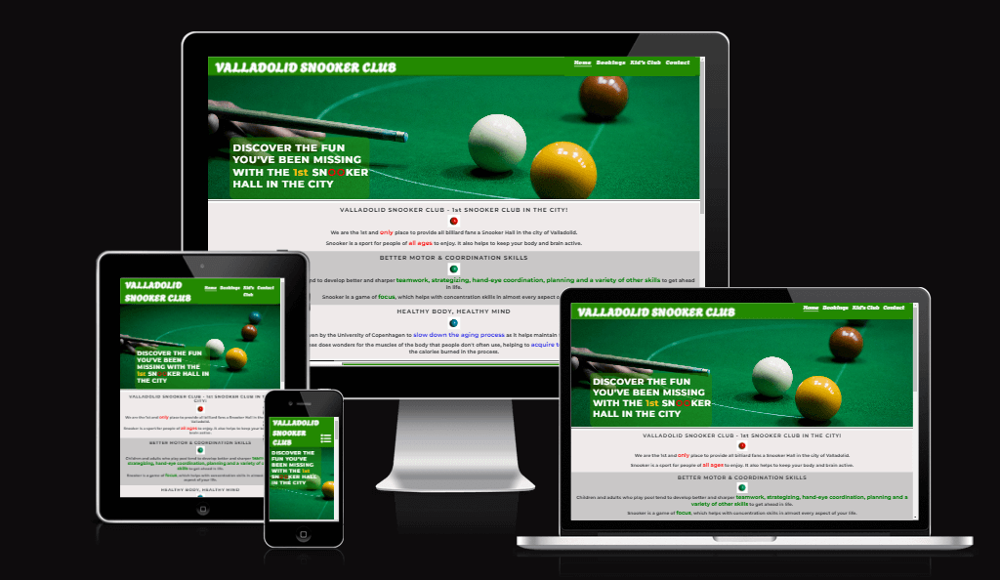
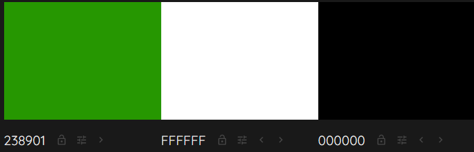
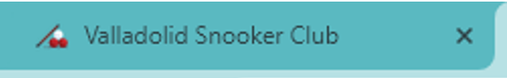
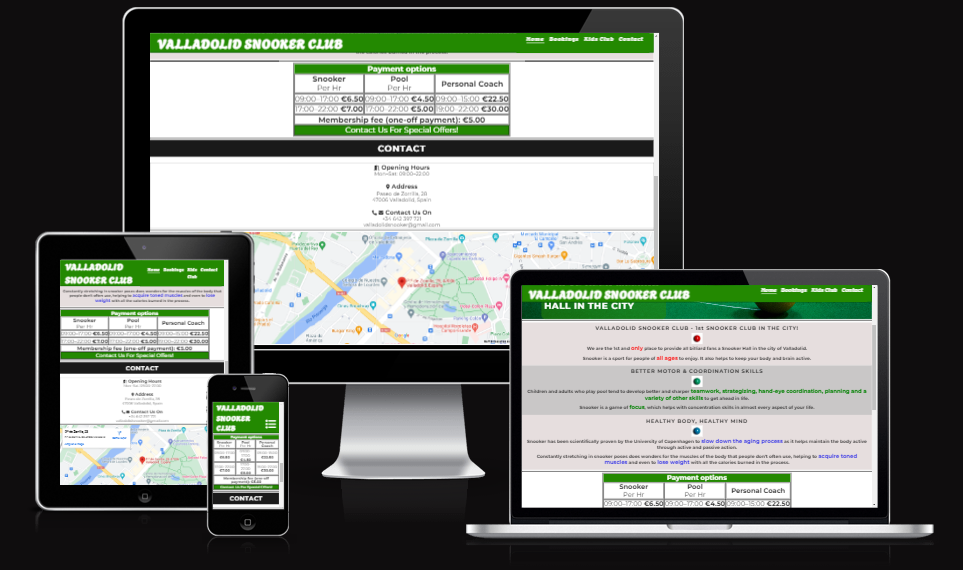
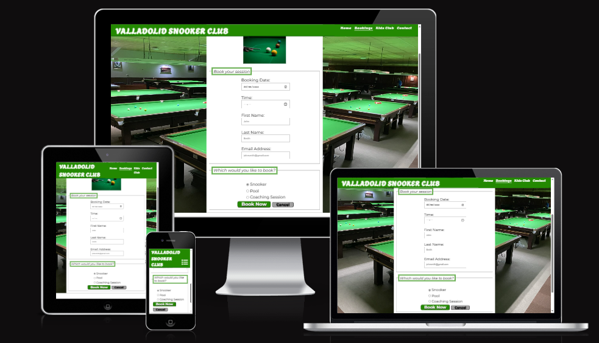
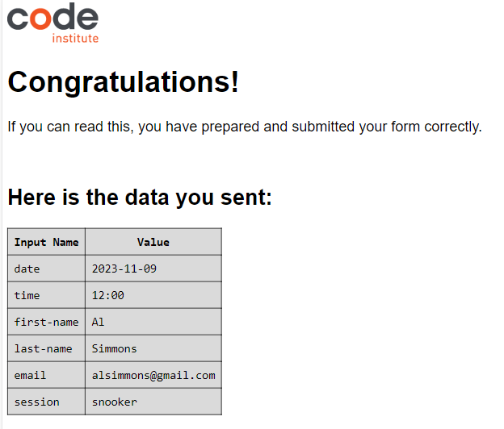
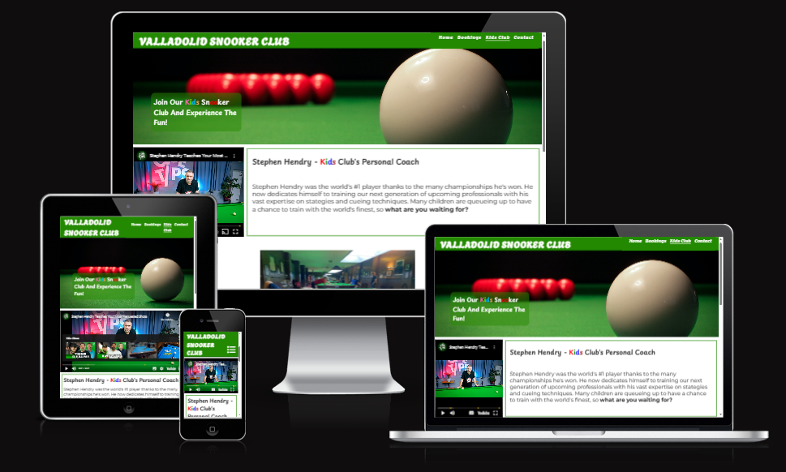
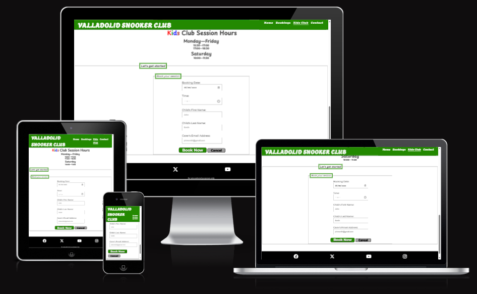
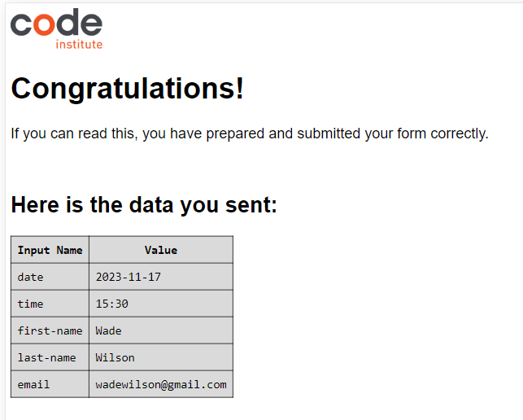

# Valladolid Snooker Club

## Project Overview

Valladolid Snooker Club is a website that has the objective of attracting more people to take up playing Snooker and see the beneficial and fun aspects of it.  It facilitates users with the possibility to meet at the venue and share their passion for the sport regardless of their age or skill.

This website aims to appeal to the local audience and encourage them to participate in an ever-growing multi-cultural sport that their country has yet to discover whether it is seeking a hobby after work or meeting with friends.  There are also many UK residents currently residing in the city who share a passion for the sport, and could greatly benefit from having a place which offers them an opportunity to continue playing what they love.

Valladolid Snooker Club also offers classes to kids at a very convenient time for parents to enrol their children seeing as after-school activities are very popular in the city. It simultaneously provides them a method to further develop their motor skills and concentration skills, and learn about a new sport which could potentially develop into a professional career.

### Live website

You can visit the website [here](https://jonathandussot.github.io/valladolid-snooker-club/)

### My GitHub Repository

You can visit the GitHub Repository [here](https://github.com/JonathanDussot/valladolid-snooker-club)

## User Experience (UX)

### Common Usage

- Valladolid Snooker Club is a physical location within the centre of the city.  Members have the option of booking their table sessions thus ensuring the satisfaction of having everything set up for them once they enter the door as opposed to having to wait for a free table.  
- Since COVID-19 we have upheld our standards of organisation by providing members with a user-friendly online booking system for all our services; Table sessions for both Snooker and Pool, Coaching Sessions, and the kids classes we offer to under-16-year-olds.
- Valladolid Snooker Club's Kids Club openly displays on the webpage the level of dedication that is given to the generation of talented youth.
- Due to its fast growth, events are currently being organized so that members may compete in open tournaments categorized into a level which matches their skillset. This information should be shortly advertised on the website in the near future.

## User Stories

### First Time Visitors

- I want to find out about the club, its prices, its variety of services and how to sign up.
- I want to be able to navigate through the website and easily find the information I am looking for.
- I want to learn more about the hobby through its benefits and the possibility of acquiring personal coaching sessions.
- I want to find the club's location and have easy access to contact information should I need it.

### First time Carers interested in Kids Club sessions

- I want to find out more information as to who will be coaching my child.
- I want to feel comfortable knowing they are in a secure and responsible club which has their best interests in mind.
- I want to get the schedule of the sessions and determine its convenience according to my child's school timetable.

### Existing Members

- I want to find a reliable booking system to provide me with accurate information in regards to table availability, especially in the case of coaching sessions.
- I want to be updated on upcoming events and/or offers.

## Design

### colour scheme

I designed the colour palette for the website myself. I only used [colormind.io](http://colormind.io/) to display the color palette of primary colours used.  Here is the list of colours used:

- #238901 / RGB(35, 137, 1)

  - This colour would give the user a certain sense of comfort considering its proximity to the colour of a typical table cloth.  This was taken into account upon creating the navigation bar and background colour of the header.  It has also been used throughout parts of the page to continue to have the feeling resonate within the users and their experience.

- White (#ffffff)

  - This colour was typically used to match the above shade of green throughout the webpage's layout. It can be seen as the main background colour used for the body elements as well as the text colour for the #238901 background colours.  Ultimately, #ffffff was chosen to guarantee accessibility through colour contrast between both colours.

- #1a1a1a / RGB(26, 26, 26) & Black (#000000)

  - This colour is used for the footer as in Pool and Snooker it typically resembles the 'last' step (black ball) and it combined perfectly with the thematic impression the page wanted to give.  It is also used for text within the white background colours.

- #e6dede / RGB(230, 222, 222) & #c9c7c7 / RGB(201, 199, 199)

  - This colour can be seen in the index.html to highlight the background colours of the area where benefits and reasons to practice the sport are given.

- Red (#ff0000), Green (#008000), Blue (#0000ff), Gold (#ffd900)

  - This colour can be seen in the index.html to highlight the keywords within the header cover-text and the area where benefits and reasons to practice the sport are given.

- Brown (#a52a2a), Hotpink (#ff69b4), Lawngreen (#7efc00), Deepskyblue (#00bfff), Sandybrown (#f4a560)

  - These colours in combination with the colours directly above are used within the kidsclub.html to give it a more welcome and friendly feeling with underage members when users enter the page.

### Typography

I used Google Fonts to import the following:

- Agbalumo is used in the navigation bar logo heading of the page.
- Montserrat (sans serif) is used in the body of the page.
- Playpen Sans is used for headings in kidsclub.html.

### Imagery

All the images added to the site are related to the sport. I wanted to use warm and appealing images to give the user the sense of wanting to be there themselves.

## Features

### General Features on each page

The website consists of three pages; Home page, Bookings page and the Kids Club page.

All pages are responsive and contain:

- Favicon of the Website
  - chosen to match the theme of the site.

- Navigation bar
  - Fully responsive and contains links to all pages as well as the contact details section in the Home page.  On a mobile device this would display a toggle navbar. The title is also a link to the Home page.

- Footer
  - Fully responsive with links that open on a new tab.

- Landing Page
  - This would be the first page the user would see, introducing the theme with the image and introductory phrase designed to catch their attention, while offering a glimpse of the benefits/ reasons section that follows as can be seen on the bigger screens.

- Interactive map
  - A map is included within the page to allow users to locate the venue and explore the area around it. Users are given the option to move the map and zoom in and out.

- Form on Bookings page
  - A fully responsive form with a button to submit and another to cancel.  The button to submit user's information takes them to a confirmation page as can be seen in the second screenshot, whereas the cancel button would automatically leave all input fields empty again.

- Media video on Kids Club page
  - This embedded YouTube video on our kids club page shares the screen horizontally once the screen is 992px or larger.  IT is not set to autoplay and the controls work well in all screen sizes.

- Form on Kids Club page
  - A fully responsive form with a button to submit and another to cancel.  The button to submit user's information takes them to a confirmation page as can be seen in the second screenshot, whereas the cancel button would automatically leave all input fields empty again.

### Future Implementations

ideas for future implementations I would like to include are:

1. A simple login functionality for them to be able to review their previous bookings and document some of their personal information such as a contact number should we need to call them.
2. Advertisement of offers/ open tournaments where many players can socialise and share their love of the game.
3. A bulletin section to report and celebrate achievements by children in the Kids Club with their parents' permission.

### Accessibility

In order to ensure that this website is as accessible friendly as possible, the following measures have been taken:

- Using semantic HTML elements.
- Providing descriptive alt attributes for all images for users with visual impairments.
- Providing information for screen readers for various features on the page including forms, navbar, footer among others.
- Ensuring there is a sufficient colour contrast throughout the site.
- Ensuring menu is accessible for screen readers by marking the current page as current.
- Designing forms taking accessibility into account, with appropriate labelling where needed.

WAVE displays an error within the navbar stating there is no aria-label.  However, I did give it an aria-label, and have not addressed the issue since it is the collapsible nav given in the walkthrough.

## Technologies Used

### Languages Used

The languages used for the website include HTML and CSS.

### Libraries and Programs Used

[icons8.com](https://icons8.com/icons) to create favicon

[Tiny PNG](https://tinypng.com/) to compress images

[GitHub](https://github.com/) to save and store my website

[Codeanywhere](https://app.codeanywhere.com/) IDE I used for this project

[Font Awesome](fontawesome.com) for the icons used on the site

[Google Fonts](https://fonts.google.com/) to import fonts used on the site

Google Dev tools - to test and fix issues detected

[Am I Responsive?](https://ui.dev/amiresponsive) to show site on all different screen sizes

[Pexels](https://www.pexels.com/) to use free images for site

[Adobe color](https://color.adobe.com/create/color-wheel) to check contrast between of colours used

[Colormind.io](http://colormind.io/) to generate color palette used.

## Deployment & Local Development

### Deployment to GitHub pages

The site is deployed using GitHub Pages. To deploy using GitHub pages:

1. Open the project repository.
2. Click on "Settings" on the navigation bar under the repository title.
3. Click on "Pages" in the left-hand navigation panel.
4. Under "Source", choose which branch to deploy. This should be Main for newer repositories.
5. Choose which folder to deploy from, usually "/root".
6. Click "Save", then wait for it to be deployed. It can take some time for the page to be fully deployed.
7. Your URL will be displayed above "Source".

You can visit the website [here](https://jonathandussot.github.io/valladolid-snooker-club/)

### Local Deployment

#### How to Fork

1. Copy the link to this repository.
2. Log in or sign up to your GitHub account and click on the **Fork** button on the top-right corner.
3. You should now have a copy included in your account.

#### How to Clone

1. Copy the link to this repository.
2. Log in or sign up to your GitHub account and click on the **Code** button.
3. You are given to option to clone using HTTPS or GitHub CLI and copy the link.

## Testing

click [here](TESTING.md) to see the all the details in regard to the testing done on the site.

## Credits

### Code Used

When creating the form, I used this code from [tutorialspoint](https://www.tutorialspoint.com/How-to-use-time-input-type-in-HTML) so I could specify the hours I wanted within the input field indicating 'Time' in both bookings page and kids club page.

`<datalist id="avail">
                                <option value="09:00"></option>`

### Content

Most of the points from the About Us & Reasons section within the home page were summarised from the information given on [bestsnookercue website](bestsnookercue.com)

### Media

- The [blue-ball.jpg](assets/images/blue-ball.jpg), [green-ball.jpg](assets/images/green-ball.jpg) and [red-ball.jpg](assets/images/red-ball.jpg) were all taken from the links to the [mcbillard.de](https://mcbillard.de/) website below respectively.  They were used to accompany my About Us & Reasons section to give a little colour and maintain the theme throughout the home page.

[blue-ball.jpg from mcbillard.de](https://mcbillard.de/product_info.php/language/en/info/p1447_Billiard-Ball-Aramith-1GTournament-Champion-blue-snooker)

[green-ball.jpg from mcbillard.de](https://mcbillard.de/product_info.php/language/en/info/p1412_Billiard-Ball-Aramith-1GTournament-Champion-green-snooker)

[red-ball.jpg from mcbillard.de](https://mcbillard.de/product_info.php/language/en/info/p1451_Billiard-Ball-Aramith-1GTournament-Champion-red-snooker)

- The [kid-snooker.jpg](assets/images/kid-snooker.jpg) was taken from the website below and helped set a sense of a professional yet friendly environment for our underage audience.

[kid-snooker.jpg from wpbsa.com](https://wpbsa.com/participation/junior-snooker/)

- The [snooker-cue-and-balls.jpg](assets/images/snooker-cue-and-balls.jpg) was taken from Pexels to set the tone for the site`s home page in the header with a sophisticated and classy look.  This photo was taken by [Qamar Rehman](https://www.pexels.com/@qamar-rehman-94539242/)

[snooker-cue-and-balls.jpg from pexels.com](https://www.pexels.com/photo/close-up-photo-of-snooker-game-11354500/)

- The [white-and-reds-big.jpg](assets/images/white-and-reds-big.jpg) was taken from Pexels. This was used within the kids club page's header.  This photo was taken by [Fritz Jaspers](https://www.pexels.com/@fritz-jaspers-746891536/)

[white-and-reds-big.jpg from pexels.com](https://www.pexels.com/photo/billiard-balls-on-a-snooker-table-18828557/)

The video media file within the kids club page was taken from the [Stephen Hendry's Cue Tips](https://www.youtube.com/watch?v=7wDxyiWBYGM) YouTube channel.

## Acknowledgements

I would like to acknowledge the following people who have been a huge help for my very first milestone project:

- [Lauren-Nicole](https://github.com/CluelessBiker) - My Code Institute Mentor for her vast amount of knowledge, relaxing demeanour and patience!

- [Kera Cudmore](https://github.com/kera-cudmore) - for her constant support through the slack community and tutorials.

- Arwen Dussot - my newborn daughter for keeping me awake at night and 'on my toes' so to speak.
