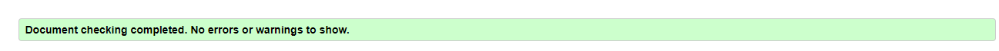
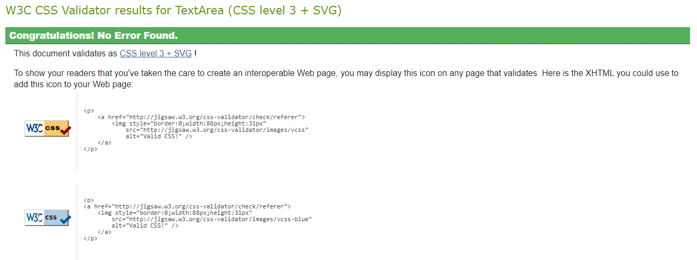

# Valladolid Snooker Club - Testing

### Live website

You can visit the website [here](https://jonathandussot.github.io/valladolid-snooker-club/)

## W3C Validator

I used the W3C Validator to validate the HTML and CSS code of the following pages below:

[index.html](index.html)

[booking.html](bookings.html)

[kidsclub.html](kidsclub.html)

[style.css](assets/css/style.css)

## Wave

## Lighthouse

## Manual Testing

### Testing User Stories

#### First Time Visitors

| Goal | How is this achieved? |
|---|---|
|I want to find out about the club, its prices, its variety of services and how to sign up.| The home page provides this information and how to contact us.|
|I want to be able to navigate through the website and easily find the information I am looking for.| The NavBar provides easy navigation to all areas of the website. |
|I want to learn more about the hobby through its benefits and the possibility of acquiring personal coaching sessions.| The home page gives information of the benefits of the sport as well as information on Coaching Lesson's times and prices.|
|I want to find the club's location and have easy access to contact information should I need it.| This is also found at the bottom of the home page with contact information and a map provided by Google Maps.|

#### First time Carers interested in Kids Club sessions

| Goal | How is this achieved? |
|---|---|
|I want to find out more information as to who will be coaching my child.| The Kids Club page gives information regarding the coach handling Kids Club.|
|I want to feel comfortable knowing they are in a secure and responsible club which has their best interests in mind.| A brief introduction is given to display our level of standards and professionalism.|
|I want to get the schedule of the sessions and determine its convenience according to my child's school timetable.| The coaching days & times can clearly be seen in the Kids Club page.|

#### Existing Members

| Goal | How is this achieved? |
|---|---|
|I want to find a reliable booking system to provide me with accurate information in regards to table availability, especially in the case of coaching sessions.| Available times can be found within the Bookings page.|
|I want to be updated on upcoming events and/or offers.| This is one of our future implementations we hope to address soon.|

### Full Testing

Full Testing was performed on each of the following features:

- Sizing was verified through the amiresponsive website to check all screen sizes.
- Navbar's logo and links direct to the appropriate destination.  Navbar correctly indicates current page on all screen sizes.
- Footer links all direct to correct websites, hover effect functions with larger screens.
- Forms' functions were tested and all passed:
  - Required input fields do not allow user to submit without providing the required information.
  - Submit button takes user to a page that confirms information given.
  - Cancel button resets the form and deletes all information given.
- Video displays adequately on all screen sizes, and is not set to autoplay.
- Map is responsive and allows user to interact without any issues.

## Bugs

- Media video on kidsclub.html wouldn't let me make it narrower.  Upon inspecting the code using Google DevTools, I discovered it was due to a line on css:269 which had it set to 100%. This was corrected and fixed in order to modify size and change structure for larger screens.

- The kid-snooker image on kidsclub.html originally wouldn't allow me to increase the width for screens 768px and larger.  I found it was because of a rule in which I had set a max-width of 450px. This was modified and fixed.
